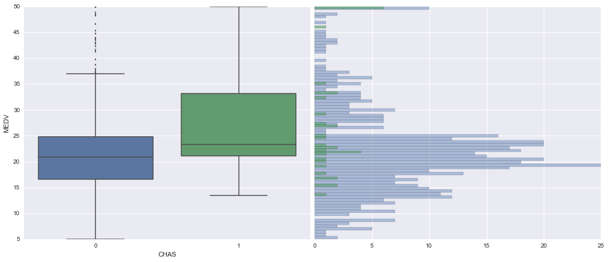
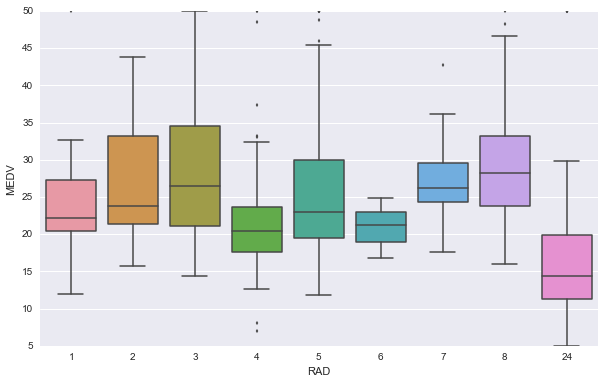
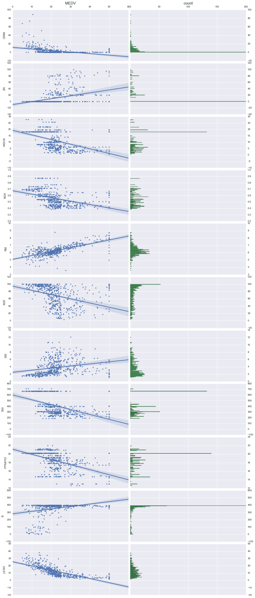
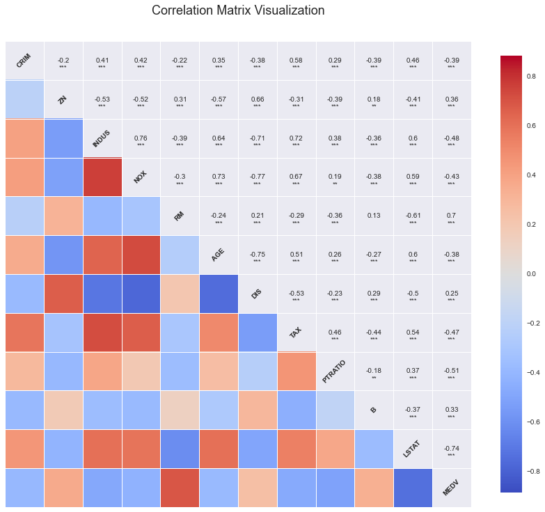

# Regression Case2: Housing Data

## Introduction

The data used in this case is [Boston Housing
Data](https://archive.ics.uci.edu/ml/machine-learning-databases/housing/), Which
concerns the housing values in suburbs of Boston. The data set include 506
instance with 12 continuous attributes, 1 categorical attribute(RAD) and 1
binary-valued attribute(CHAS).


- CRIM      per capita crime rate by town
- ZN        proportion of residential land zoned for lots over 25,000 sq.ft.
- INDUS     proportion of non-retail business acres per town
- CHAS      Charles River dummy variable (= 1 if tract bounds river; 0
otherwise)
- NOX       nitric oxides concentration (parts per 10 million)
- RM        average number of rooms per dwelling
- AGE       proportion of owner-occupied units built prior to 1940
- DIS       weighted distances to five Boston employment centres
- RAD       index of accessibility to radial highways
- TAX      full-value property-tax rate per \$10,000
- PTRATIO  pupil-teacher ratio by town
- B        1000(Bk - 0.63)^2 where Bk is the proportion of blacks by town
- LSTAT    % lower status of the population
- MEDV     Median value of owner-occupied homes in $1000's


### Object

The object of this case is to use all these attribute to build a linear
regression model to predict the median housing value(MEDV) in Boston.

## Descriptive Statistics

- Statistics summary of the data
- Visualize the data

```
    from ggplot import *
    import numpy as np
    import pandas as pd
    from sklearn import linear_model
    
    import seaborn as sns
    import matplotlib as mpl
    import matplotlib.pyplot as plt
    import matplotlib.gridspec as gridspec
```
### Statistics Summary

```
    housing = pd.read_csv("housing.data",delim_whitespace=True,header=None)
    colnames = ['CRIM','ZN','INDUS','CHAS','NOX','RM','AGE','DIS','RAD','TAX','PTRATIO','B','LSTAT','MEDV']
    housing.columns = colnames
    housing.head()
```


<div style="max-height:1000px;max-width:1500px;overflow:auto;">
<table border="1" class="dataframe">
  <thead>
    <tr style="text-align: right;">
      <th></th>
      <th>CRIM</th>
      <th>ZN</th>
      <th>INDUS</th>
      <th>CHAS</th>
      <th>NOX</th>
      <th>RM</th>
      <th>AGE</th>
      <th>DIS</th>
      <th>RAD</th>
      <th>TAX</th>
      <th>PTRATIO</th>
      <th>B</th>
      <th>LSTAT</th>
      <th>MEDV</th>
    </tr>
  </thead>
  <tbody>
    <tr>
      <th>0</th>
      <td> 0.00632</td>
      <td> 18</td>
      <td> 2.31</td>
      <td> 0</td>
      <td> 0.538</td>
      <td> 6.575</td>
      <td> 65.2</td>
      <td> 4.0900</td>
      <td> 1</td>
      <td> 296</td>
      <td> 15.3</td>
      <td> 396.90</td>
      <td> 4.98</td>
      <td> 24.0</td>
    </tr>
    <tr>
      <th>1</th>
      <td> 0.02731</td>
      <td>  0</td>
      <td> 7.07</td>
      <td> 0</td>
      <td> 0.469</td>
      <td> 6.421</td>
      <td> 78.9</td>
      <td> 4.9671</td>
      <td> 2</td>
      <td> 242</td>
      <td> 17.8</td>
      <td> 396.90</td>
      <td> 9.14</td>
      <td> 21.6</td>
    </tr>
    <tr>
      <th>2</th>
      <td> 0.02729</td>
      <td>  0</td>
      <td> 7.07</td>
      <td> 0</td>
      <td> 0.469</td>
      <td> 7.185</td>
      <td> 61.1</td>
      <td> 4.9671</td>
      <td> 2</td>
      <td> 242</td>
      <td> 17.8</td>
      <td> 392.83</td>
      <td> 4.03</td>
      <td> 34.7</td>
    </tr>
    <tr>
      <th>3</th>
      <td> 0.03237</td>
      <td>  0</td>
      <td> 2.18</td>
      <td> 0</td>
      <td> 0.458</td>
      <td> 6.998</td>
      <td> 45.8</td>
      <td> 6.0622</td>
      <td> 3</td>
      <td> 222</td>
      <td> 18.7</td>
      <td> 394.63</td>
      <td> 2.94</td>
      <td> 33.4</td>
    </tr>
    <tr>
      <th>4</th>
      <td> 0.06905</td>
      <td>  0</td>
      <td> 2.18</td>
      <td> 0</td>
      <td> 0.458</td>
      <td> 7.147</td>
      <td> 54.2</td>
      <td> 6.0622</td>
      <td> 3</td>
      <td> 222</td>
      <td> 18.7</td>
      <td> 396.90</td>
      <td> 5.33</td>
      <td> 36.2</td>
    </tr>
  </tbody>
</table>
</div>


The statistical summary for all the continuous attributes.

```
    housing_1 = housing.drop('CHAS',1).drop('RAD',1)
    housing_1.describe()
```


<div style="max-height:1000px;max-width:1500px;overflow:auto;">
<table border="1" class="dataframe">
  <thead>
    <tr style="text-align: right;">
      <th></th>
      <th>CRIM</th>
      <th>ZN</th>
      <th>INDUS</th>
      <th>NOX</th>
      <th>RM</th>
      <th>AGE</th>
      <th>DIS</th>
      <th>TAX</th>
      <th>PTRATIO</th>
      <th>B</th>
      <th>LSTAT</th>
      <th>MEDV</th>
    </tr>
  </thead>
  <tbody>
    <tr>
      <th>count</th>
      <td> 506.000000</td>
      <td> 506.000000</td>
      <td> 506.000000</td>
      <td> 506.000000</td>
      <td> 506.000000</td>
      <td> 506.000000</td>
      <td> 506.000000</td>
      <td> 506.000000</td>
      <td> 506.000000</td>
      <td> 506.000000</td>
      <td> 506.000000</td>
      <td> 506.000000</td>
    </tr>
    <tr>
      <th>mean</th>
      <td>   3.613524</td>
      <td>  11.363636</td>
      <td>  11.136779</td>
      <td>   0.554695</td>
      <td>   6.284634</td>
      <td>  68.574901</td>
      <td>   3.795043</td>
      <td> 408.237154</td>
      <td>  18.455534</td>
      <td> 356.674032</td>
      <td>  12.653063</td>
      <td>  22.532806</td>
    </tr>
    <tr>
      <th>std</th>
      <td>   8.601545</td>
      <td>  23.322453</td>
      <td>   6.860353</td>
      <td>   0.115878</td>
      <td>   0.702617</td>
      <td>  28.148861</td>
      <td>   2.105710</td>
      <td> 168.537116</td>
      <td>   2.164946</td>
      <td>  91.294864</td>
      <td>   7.141062</td>
      <td>   9.197104</td>
    </tr>
    <tr>
      <th>min</th>
      <td>   0.006320</td>
      <td>   0.000000</td>
      <td>   0.460000</td>
      <td>   0.385000</td>
      <td>   3.561000</td>
      <td>   2.900000</td>
      <td>   1.129600</td>
      <td> 187.000000</td>
      <td>  12.600000</td>
      <td>   0.320000</td>
      <td>   1.730000</td>
      <td>   5.000000</td>
    </tr>
    <tr>
      <th>25%</th>
      <td>   0.082045</td>
      <td>   0.000000</td>
      <td>   5.190000</td>
      <td>   0.449000</td>
      <td>   5.885500</td>
      <td>  45.025000</td>
      <td>   2.100175</td>
      <td> 279.000000</td>
      <td>  17.400000</td>
      <td> 375.377500</td>
      <td>   6.950000</td>
      <td>  17.025000</td>
    </tr>
    <tr>
      <th>50%</th>
      <td>   0.256510</td>
      <td>   0.000000</td>
      <td>   9.690000</td>
      <td>   0.538000</td>
      <td>   6.208500</td>
      <td>  77.500000</td>
      <td>   3.207450</td>
      <td> 330.000000</td>
      <td>  19.050000</td>
      <td> 391.440000</td>
      <td>  11.360000</td>
      <td>  21.200000</td>
    </tr>
    <tr>
      <th>75%</th>
      <td>   3.677082</td>
      <td>  12.500000</td>
      <td>  18.100000</td>
      <td>   0.624000</td>
      <td>   6.623500</td>
      <td>  94.075000</td>
      <td>   5.188425</td>
      <td> 666.000000</td>
      <td>  20.200000</td>
      <td> 396.225000</td>
      <td>  16.955000</td>
      <td>  25.000000</td>
    </tr>
    <tr>
      <th>max</th>
      <td>  88.976200</td>
      <td> 100.000000</td>
      <td>  27.740000</td>
      <td>   0.871000</td>
      <td>   8.780000</td>
      <td> 100.000000</td>
      <td>  12.126500</td>
      <td> 711.000000</td>
      <td>  22.000000</td>
      <td> 396.900000</td>
      <td>  37.970000</td>
      <td>  50.000000</td>
    </tr>
  </tbody>
</table>
</div>


Summary of the 2 discret attributes.


    housing_2 = housing[['CHAS','RAD']].copy()
    housing_2 = housing_2.astype(str)
    count = housing_2['RAD'].value_counts()
    df_count = pd.DataFrame(count)
    df_count.columns = ['count']
    df_count.index.name = 'RAD'
    df_count.transpose()

    RAD     24    5    4   3   6   8   2   1   7
    count  132  115  110  38  26  24  24  20  17


<div style="max-height:1000px;max-width:1500px;overflow:auto;">
<table border="1" class="dataframe">
  <thead>
    <tr style="text-align: right;">
      <th>RAD</th>
      <th>24</th>
      <th>5</th>
      <th>4</th>
      <th>3</th>
      <th>6</th>
      <th>8</th>
      <th>2</th>
      <th>1</th>
      <th>7</th>
    </tr>
  </thead>
  <tbody>
    <tr>
      <th>count</th>
      <td> 132</td>
      <td> 115</td>
      <td> 110</td>
      <td> 38</td>
      <td> 26</td>
      <td> 24</td>
      <td> 24</td>
      <td> 20</td>
      <td> 17</td>
    </tr>
  </tbody>
</table>
</div>


    count = housing_2['CHAS'].value_counts()
    df_count = pd.DataFrame(count)
    df_count.columns = ['count']
    df_count.index.name = 'CHAS'
    df_count.transpose()


<div style="max-height:1000px;max-width:1500px;overflow:auto;">
<table border="1" class="dataframe">
  <thead>
    <tr style="text-align: right;">
      <th>CHAS</th>
      <th>0</th>
      <th>1</th>
    </tr>
  </thead>
  <tbody>
    <tr>
      <th>count</th>
      <td> 471</td>
      <td> 35</td>
    </tr>
  </tbody>
</table>
</div>


### Data Visualization


    # This line configures matplotlib to show figures embedded in the notebook, 
    # instead of opening a new window for each figure. More about that later. 
    %matplotlib inline


    fig = plt.figure(figsize=(15,8))
    plt.ylabel('frequency', fontsize=15)
    plt.xlabel('Median value of owner-occupied homes in $1000\'s',fontsize=15)
    plt.title('Histogram of MEDV \n',fontsize=20)
    housing.MEDV.hist(bins=200)


    <matplotlib.axes.AxesSubplot at 0x7f5edfa0f250>


The histogram shows the distribution of the median housing value. The median
housing value is unusually highly concentrate in 50.


    CHAS_0 = housing[housing.CHAS==0]
    CHAS_1 = housing[housing.CHAS==1]
    
    fig = plt.figure(figsize=(14,6))
    gs = gridspec.GridSpec(1, 2)
    ax1 = plt.subplot(gs[0,0])
    ax2 = plt.subplot(gs[0,1])
    sns.boxplot(housing.MEDV,housing.CHAS,ax=ax1)
    ylim = ax1.get_ylim()
    CHAS_0.iloc[:,-1].hist(orientation='horizontal',bins=80,alpha=0.4,ax=ax2)
    CHAS_1.iloc[:,-1].hist(orientation='horizontal',bins=80,alpha=0.6,ax=ax2)
    ax2.set_ylim((ylim[0], ylim[1]))
    for tick in ax2.yaxis.get_major_ticks():
        tick.label1On = False
        tick.label2On = False
    plt.tight_layout(pad=0.4, w_pad=0.5, h_pad=0)





- CHAS=1 has higher housing value than CHAS=0
- Instances with CHAS=0 is much more than CHAS=1


    fig = plt.figure(figsize=(10,6))
    sns.boxplot(housing.MEDV,housing.RAD)


    <matplotlib.axes.AxesSubplot at 0x7f5edc5438d0>





- RAD 3 has the top housing value compare to others.
- Housing value in RAD 24 is significantly lower than ther others.


    df = housing_1.drop("MEDV",1)
    
    import matplotlib.gridspec as gridspec
    import matplotlib as mpl
    import matplotlib.pyplot as plt
    
    fig = plt.figure(figsize=(14,33))
    gs = gridspec.GridSpec(11, 2)
    
    for i in range(11):
        ax1 = plt.subplot(gs[i,0])
        ax2 = plt.subplot(gs[i,1])    
        sns.regplot('MEDV',df.columns[i],housing_1,ax=ax1)
        ax1.set_title('')
        ax1.set_xlabel('')
        ylim = ax1.get_ylim()   
        df[df.columns[i]].hist(bins=80,ax=ax2,orientation='horizontal')    
        ax2.set_ylim((ylim[0], ylim[1]))
        ax2.set_xlabel('')
        ax2.set_xlim((0,200))
        for tick in ax2.yaxis.get_major_ticks():
            tick.label1On = False
            tick.label2On = True
        if i!=0:
            ax1.set_xticklabels([''])
            ax2.set_xticklabels([''])
        else:
            ax1.set_title('MEDV \n',size=15)
            ax2.set_title('count \n',size=15)
            for tick in ax1.xaxis.get_major_ticks():
                tick.label1On = False
                tick.label2On = True
            for tick in ax2.xaxis.get_major_ticks():
                tick.label1On = False
                tick.label2On = True
    plt.tight_layout(pad=0, w_pad=0, h_pad=0)





The graph above shows the distribution of the continuous attributes and their
relationship to housing values:

- More than half of $CRIM$ and $ZN$ are concentrate between 0 and 1.
- It is obvious to see he relationship between $RM$, $LSTAT$ and housing value.
- Some relationships are not that significant, such as $CRIM$ and $ZN$.


    fig = plt.figure(figsize=(15,15))
    sns.corrplot(housing_1)
    plt.title("Correlation Matrix Visualization",fontsize=18)


    <matplotlib.text.Text at 0x7f5e009ab110>





According the correlation matrix graph, we can see some atributes are highly
correlated with others, such like $INDUS$ are highly correlated with
$NOX$(0.76), $AGE$(0.64), $DIS$(-0.71), $TAX$(0.72); $DIS$ are highly correlated
with $ZN$(0.66), $INDUS$(-0.71), $NOX$(-0.77), $AGE$(-0.75). While some
attributes like $PTRATIO$ and $B$ do not have any significant relationship with
any other attributes.

## Regression Model

Set up dummy variable RAD.


    df = housing.copy()
    df.drop('RAD',1)
    rad = pd.get_dummies(df.RAD,prefix='RAD_')
    df1 = pd.concat([df,rad[rad.columns[1:]]],axis=1)
    rad.head()


<div style="max-height:1000px;max-width:1500px;overflow:auto;">
<table border="1" class="dataframe">
  <thead>
    <tr style="text-align: right;">
      <th></th>
      <th>RAD__1</th>
      <th>RAD__2</th>
      <th>RAD__3</th>
      <th>RAD__4</th>
      <th>RAD__5</th>
      <th>RAD__6</th>
      <th>RAD__7</th>
      <th>RAD__8</th>
      <th>RAD__24</th>
    </tr>
  </thead>
  <tbody>
    <tr>
      <th>0</th>
      <td> 1</td>
      <td> 0</td>
      <td> 0</td>
      <td> 0</td>
      <td> 0</td>
      <td> 0</td>
      <td> 0</td>
      <td> 0</td>
      <td> 0</td>
    </tr>
    <tr>
      <th>1</th>
      <td> 0</td>
      <td> 1</td>
      <td> 0</td>
      <td> 0</td>
      <td> 0</td>
      <td> 0</td>
      <td> 0</td>
      <td> 0</td>
      <td> 0</td>
    </tr>
    <tr>
      <th>2</th>
      <td> 0</td>
      <td> 1</td>
      <td> 0</td>
      <td> 0</td>
      <td> 0</td>
      <td> 0</td>
      <td> 0</td>
      <td> 0</td>
      <td> 0</td>
    </tr>
    <tr>
      <th>3</th>
      <td> 0</td>
      <td> 0</td>
      <td> 1</td>
      <td> 0</td>
      <td> 0</td>
      <td> 0</td>
      <td> 0</td>
      <td> 0</td>
      <td> 0</td>
    </tr>
    <tr>
      <th>4</th>
      <td> 0</td>
      <td> 0</td>
      <td> 1</td>
      <td> 0</td>
      <td> 0</td>
      <td> 0</td>
      <td> 0</td>
      <td> 0</td>
      <td> 0</td>
    </tr>
  </tbody>
</table>
</div>


#### Regression Model
- We use linear regression to predict the per capita crime rate

$$
y_i =\beta_0 +  X_i\beta_1 + RAD_i\beta_2 +CHAS_i\beta_3 + \epsilon_i
$$

- $\beta_0$ is the intercept.
- $X_i$ is 1 row 12 columns matrix of the 12 continuous variables for instance
$i$,
- $\beta_1$ is the coefficients for these 12 variables. $RAD_i$ is 1 row 8
columns(without RAD_1) matirx for categorical attribute RAD for instance $i$.
- $CHAS_i$ is the dummy variable for CHAS for instance $i$.
- $y_i$ is the median housing value for instance $i$.
- $\epsilon_i$ is the error of the prediction of the model.

#### Train The Model and Get The Coefficients

Set up the training set and test set.


    df=df1
    import random
    train_idx = random.sample(df.index,int(0.7*len(df)))
    df_train = df.ix[train_idx]
    df_test = df[~df.index.isin(train_idx)]
    dfx_train = df_train.drop('MEDV',1)
    dfy_train = df_train.MEDV
    dfx_test = df_test.drop('MEDV',1)
    dfy_test = df_test.MEDV


    def train_and_evaluate(clf,X_train, X_test, y_train, y_test):
        clf.fit(X_train, y_train)
        
        print "R^2 for training set:"
        print clf.score(X_train, y_train)
        print "R^2 for test set:"
        print clf.score(X_test, y_test)

train and evaluate the model


    lm = linear_model.LinearRegression()
    
    train_and_evaluate(lm,dfx_train,dfx_test,dfy_train,dfy_test)

    R^2 for training set:
    0.717523973586
    R^2 for test set:
    0.767565576265


Show the coefficient and intercept


    lm = linear_model.LinearRegression()
    lm.fit(dfx_train,dfy_train)
    colnames = dfx_train.columns.values
    result = pd.DataFrame(lm.coef_).transpose()
    result.columns = colnames.tolist()
    result['intercept'] = lm.intercept_ 
    result = result.transpose()
    result.columns = ['coefficient']
    
    result


<div style="max-height:1000px;max-width:1500px;overflow:auto;">
<table border="1" class="dataframe">
  <thead>
    <tr style="text-align: right;">
      <th></th>
      <th>coefficient</th>
    </tr>
  </thead>
  <tbody>
    <tr>
      <th>CRIM</th>
      <td> -0.114031</td>
    </tr>
    <tr>
      <th>ZN</th>
      <td>  0.054796</td>
    </tr>
    <tr>
      <th>INDUS</th>
      <td> -0.017841</td>
    </tr>
    <tr>
      <th>CHAS</th>
      <td>  1.014131</td>
    </tr>
    <tr>
      <th>NOX</th>
      <td>-15.484421</td>
    </tr>
    <tr>
      <th>RM</th>
      <td>  2.691058</td>
    </tr>
    <tr>
      <th>AGE</th>
      <td>  0.004768</td>
    </tr>
    <tr>
      <th>DIS</th>
      <td> -1.454166</td>
    </tr>
    <tr>
      <th>RAD</th>
      <td>  0.401076</td>
    </tr>
    <tr>
      <th>TAX</th>
      <td> -0.011967</td>
    </tr>
    <tr>
      <th>PTRATIO</th>
      <td> -0.914515</td>
    </tr>
    <tr>
      <th>B</th>
      <td>  0.006908</td>
    </tr>
    <tr>
      <th>LSTAT</th>
      <td> -0.521813</td>
    </tr>
    <tr>
      <th>RAD__2</th>
      <td>  0.327173</td>
    </tr>
    <tr>
      <th>RAD__3</th>
      <td>  2.734097</td>
    </tr>
    <tr>
      <th>RAD__4</th>
      <td>  0.754395</td>
    </tr>
    <tr>
      <th>RAD__5</th>
      <td>  0.968590</td>
    </tr>
    <tr>
      <th>RAD__6</th>
      <td> -1.318666</td>
    </tr>
    <tr>
      <th>RAD__7</th>
      <td>  1.241595</td>
    </tr>
    <tr>
      <th>RAD__8</th>
      <td>  2.428347</td>
    </tr>
    <tr>
      <th>RAD__24</th>
      <td> -1.277674</td>
    </tr>
    <tr>
      <th>intercept</th>
      <td> 40.885778</td>
    </tr>
  </tbody>
</table>
</div>


Few coefficients have the sign different from previous plot:

- AGE is negative relate to housing value according the plot, while its
coefficient is a small positive number.
- RAD_4 has lower housing value than RAD_1 in plots, but the coefficient is
positive.


#### Prediction of the model


    housing_test = housing[~df.index.isin(train_idx)]
    housing_test_x = housing_test.drop('MEDV',1)
    housing_test_pred = lm.predict(dfx_test)
    pred = housing_test_x.copy()
    pred['predicted_MEDV'] = housing_test_pred
    pred['actual_MEDV'] = dfy_test
    pred.head()


<div style="max-height:1000px;max-width:1500px;overflow:auto;">
<table border="1" class="dataframe">
  <thead>
    <tr style="text-align: right;">
      <th></th>
      <th>CRIM</th>
      <th>ZN</th>
      <th>INDUS</th>
      <th>CHAS</th>
      <th>NOX</th>
      <th>RM</th>
      <th>AGE</th>
      <th>DIS</th>
      <th>RAD</th>
      <th>TAX</th>
      <th>PTRATIO</th>
      <th>B</th>
      <th>LSTAT</th>
      <th>predicted_MEDV</th>
      <th>actual_MEDV</th>
    </tr>
  </thead>
  <tbody>
    <tr>
      <th>1 </th>
      <td> 0.02731</td>
      <td>  0.0</td>
      <td> 7.07</td>
      <td> 0</td>
      <td> 0.469</td>
      <td> 6.421</td>
      <td> 78.9</td>
      <td> 4.9671</td>
      <td> 2</td>
      <td> 242</td>
      <td> 17.8</td>
      <td> 396.90</td>
      <td>  9.14</td>
      <td> 23.854069</td>
      <td> 21.6</td>
    </tr>
    <tr>
      <th>3 </th>
      <td> 0.03237</td>
      <td>  0.0</td>
      <td> 2.18</td>
      <td> 0</td>
      <td> 0.458</td>
      <td> 6.998</td>
      <td> 45.8</td>
      <td> 6.0622</td>
      <td> 3</td>
      <td> 222</td>
      <td> 18.7</td>
      <td> 394.63</td>
      <td>  2.94</td>
      <td> 29.357370</td>
      <td> 33.4</td>
    </tr>
    <tr>
      <th>5 </th>
      <td> 0.02985</td>
      <td>  0.0</td>
      <td> 2.18</td>
      <td> 0</td>
      <td> 0.458</td>
      <td> 6.430</td>
      <td> 58.7</td>
      <td> 6.0622</td>
      <td> 3</td>
      <td> 222</td>
      <td> 18.7</td>
      <td> 394.12</td>
      <td>  5.21</td>
      <td> 26.702602</td>
      <td> 28.7</td>
    </tr>
    <tr>
      <th>7 </th>
      <td> 0.14455</td>
      <td> 12.5</td>
      <td> 7.87</td>
      <td> 0</td>
      <td> 0.524</td>
      <td> 6.172</td>
      <td> 96.1</td>
      <td> 5.9505</td>
      <td> 5</td>
      <td> 311</td>
      <td> 15.2</td>
      <td> 396.90</td>
      <td> 19.15</td>
      <td> 19.814947</td>
      <td> 27.1</td>
    </tr>
    <tr>
      <th>14</th>
      <td> 0.63796</td>
      <td>  0.0</td>
      <td> 8.14</td>
      <td> 0</td>
      <td> 0.538</td>
      <td> 6.096</td>
      <td> 84.5</td>
      <td> 4.4619</td>
      <td> 4</td>
      <td> 307</td>
      <td> 21.0</td>
      <td> 380.02</td>
      <td> 10.26</td>
      <td> 19.407706</td>
      <td> 18.2</td>
    </tr>
  </tbody>
</table>
</div>


## Refference

 - Bache, K. & Lichman, M. (2013). UCI Machine Learning Repository
[http://archive.ics.uci.edu/ml]. Irvine, CA: University of California, School of
Information and Computer Science.
